# AI监控灾害损失:遥感+无人机+精算
“科创中国”技术路演

**司马数慧 苏锦华**

官网: simashuhui.cn(ICP备案核审中)
(备案前内测: smartdata.xiaoneko.site)

---

## Content

<!-- fitting -->

1. 司马数慧团队简介

2. 国内灾险难做,国外保险科技有解法

3. 遥感-无人机-AI定损

4. 自动定价-承保-定损-理赔全流程灾险方案

5. 定位与路径:漫谈已有工作和展望

---

## 司马数慧团队简介

  
 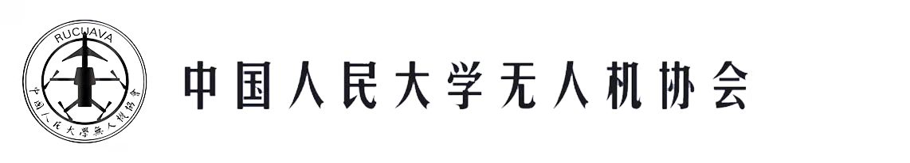

---

## 国内灾险难做

**1.天灾与地方财政**

- 灾害损失与救灾拨款
- 抗震泄洪投资有限

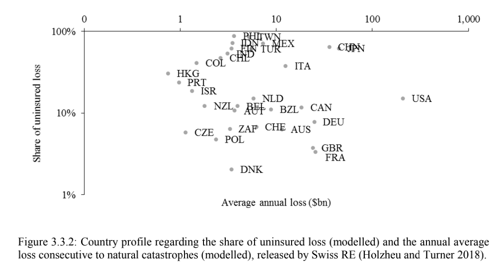

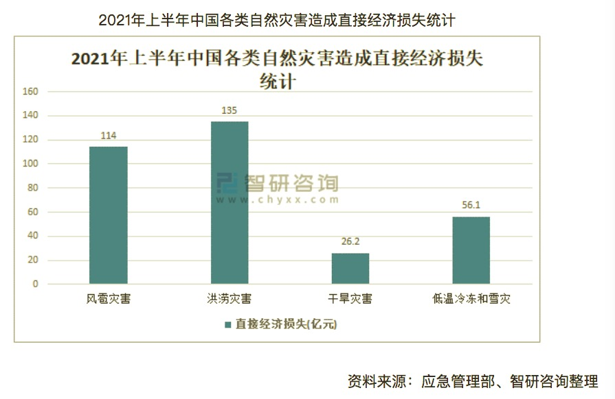
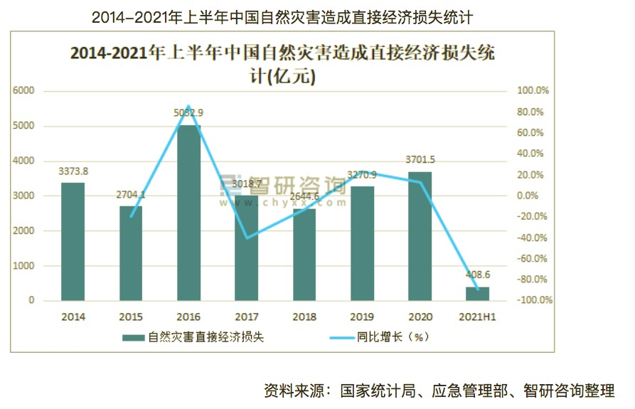

---

## 国内灾险难做
**2.不敢涉足灾险的中国保司**

- 爆亏的江浙洪水险
- 房屋损失险 != 灾险
- 括弧：不包含川渝、西南地区

---

## 国外保险科技有解法

**1.指数型保险与NatCat评审委员会**

- 指数保险与实际损失偿付保险
- 法国保险覆盖率**NatCat**

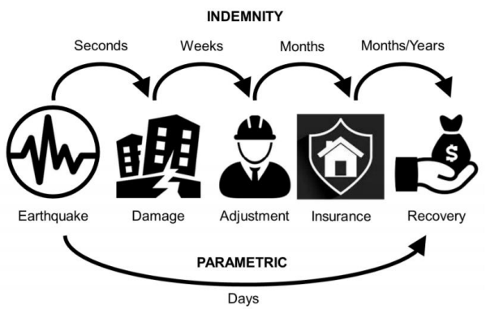

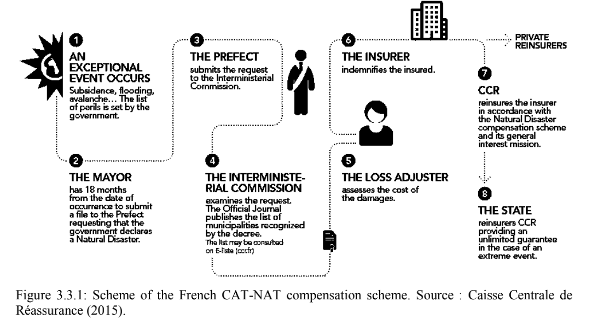

---
## 国外保险科技有解法

**2.基于卫星影像的自动承保理赔**

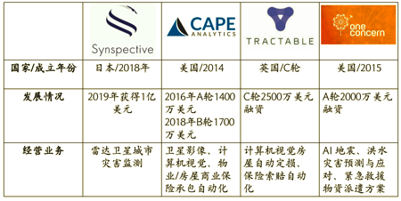 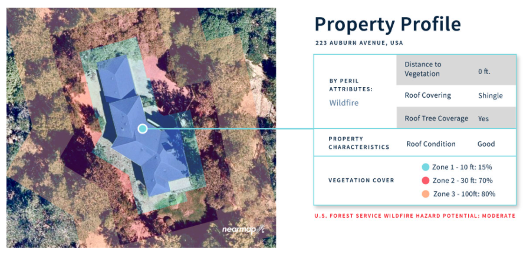

---

## 遥感-无人机-AI定损

**1.遥感变化检测**

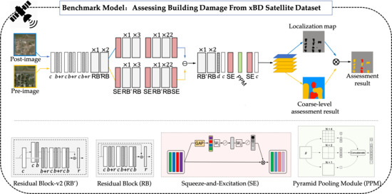

---

## 遥感-无人机-AI定损

**2.无人机三维重建**

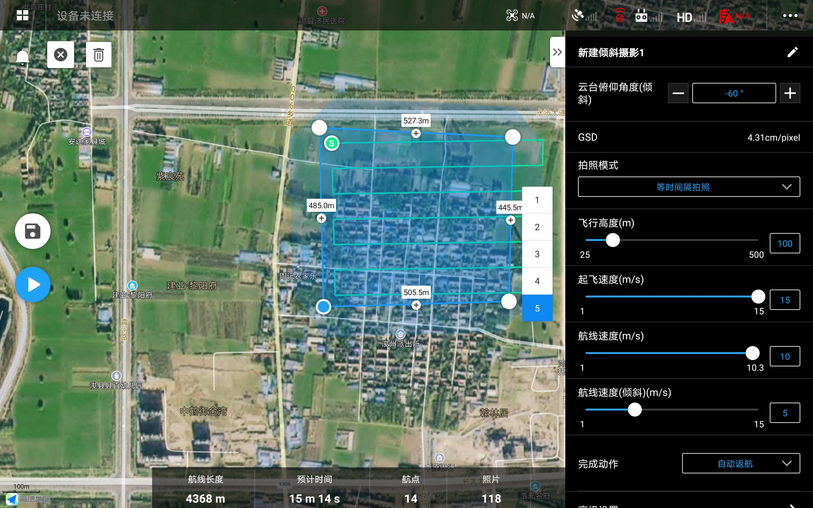 

---

## 自动定价-承保-定损-理赔全流程灾险方案

**1.DLI指数保险(灾前承保)**

$$DLI_{area}=\sum_{i \in area} \hat{A_i} \hat{D^*_i} \sim N(\sum \hat{X^*_i},\sigma_{DLI_{area}})$$

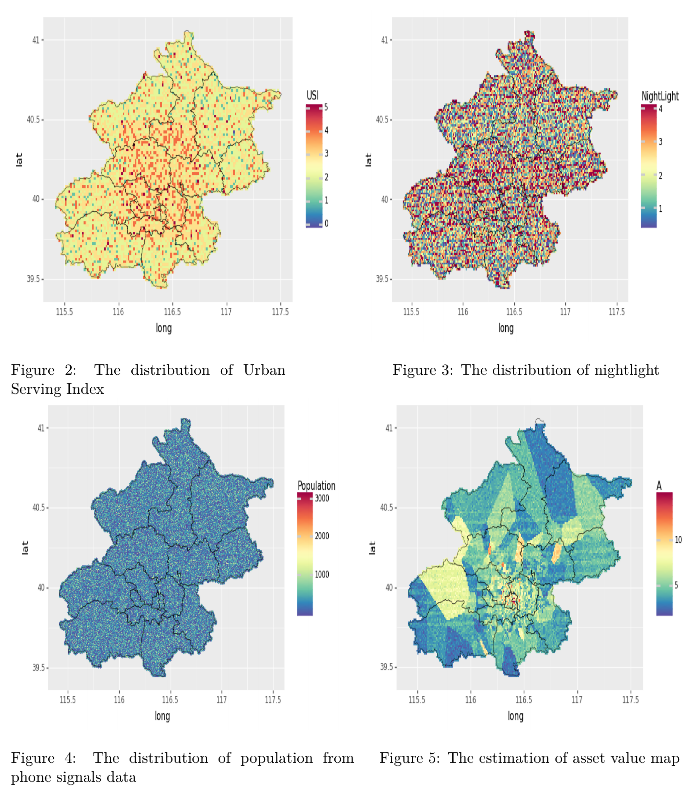

---

## 自动定价-承保-定损-理赔全流程灾险方案

**2.卫星遥感受灾监控(保单管理+用户运营)**

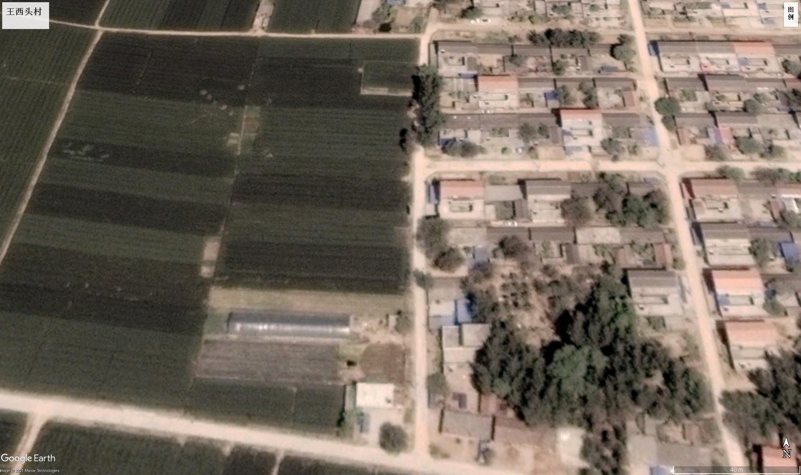 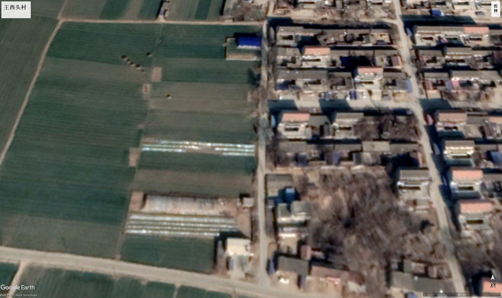 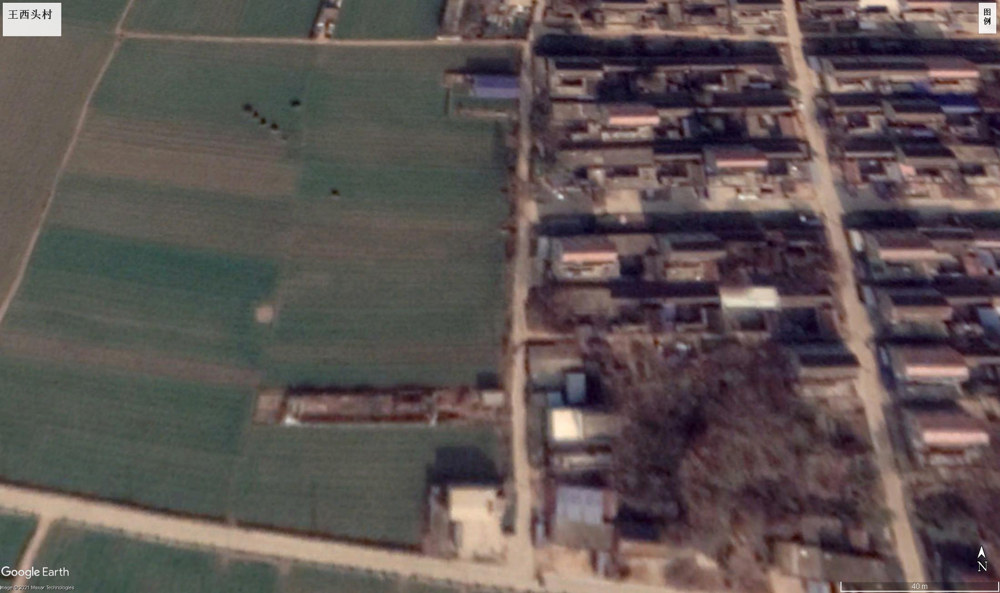 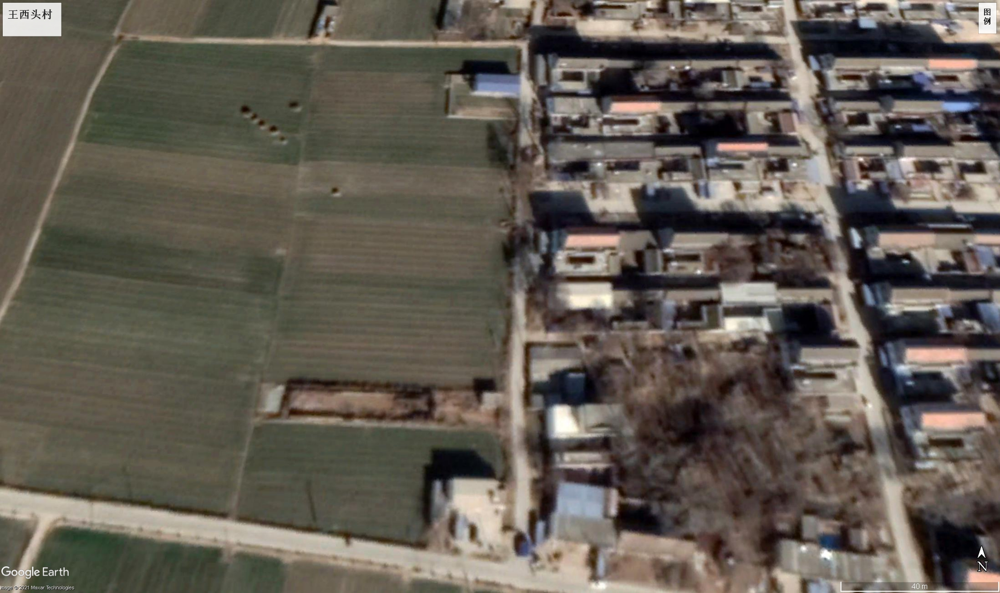

---

## 自动定价-承保-定损-理赔全流程灾险方案

**3.无人机灾后采样评估(快速定损理赔)**

  
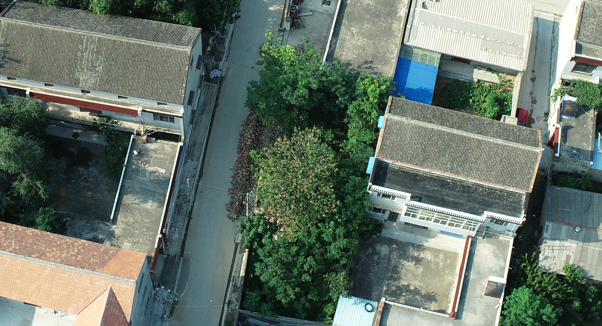

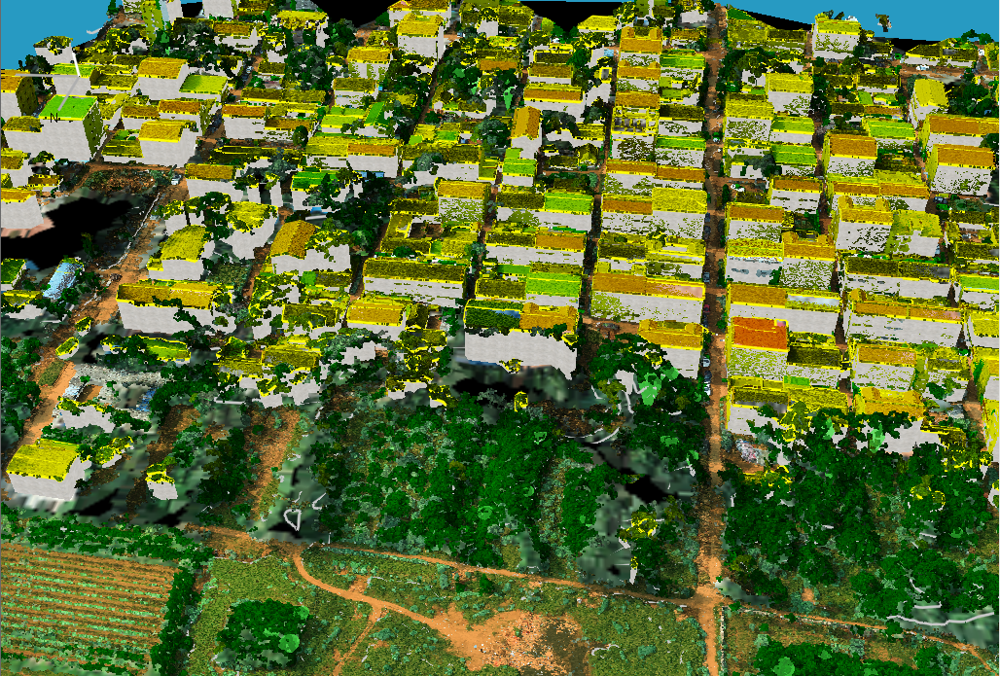

---

## 定位与路径:漫谈已有工作和展望

**1.公司定位与产品** (遥感+无人机)
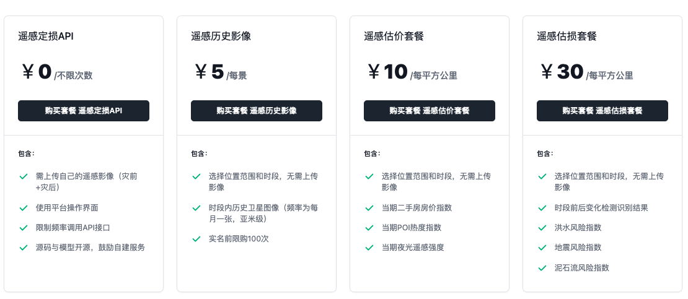
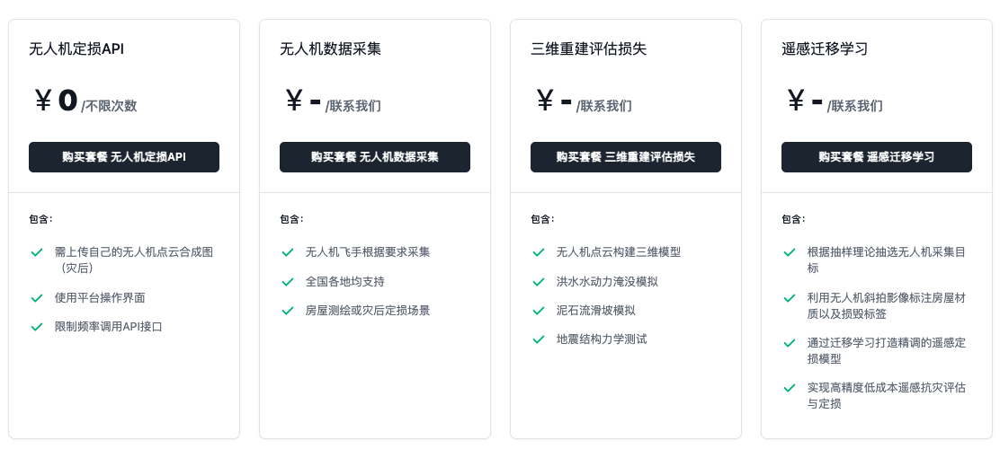

---

## 定位与路径:漫谈已有工作和展望

**2.多源数据+CV技术+精算**

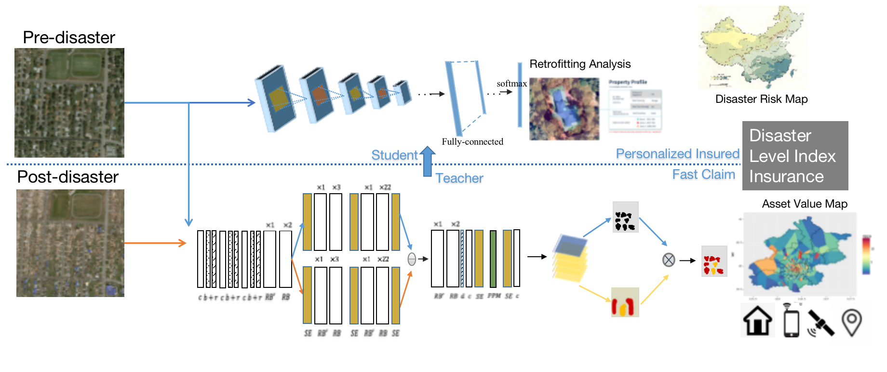 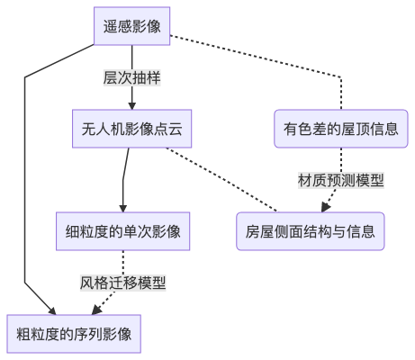

---

## 定位与路径:漫谈已有工作和展望

**3.社会责任：关注国内灾害，建立开源灾后影像数据库**

> 武汉长江救援志愿队于22日在有关方面的安排下，转赴灾情严重的鹤壁。8月1日-3日，人大无人机社两名飞手前往河南鹤壁，设备是大疆精灵4Pro和RTX。

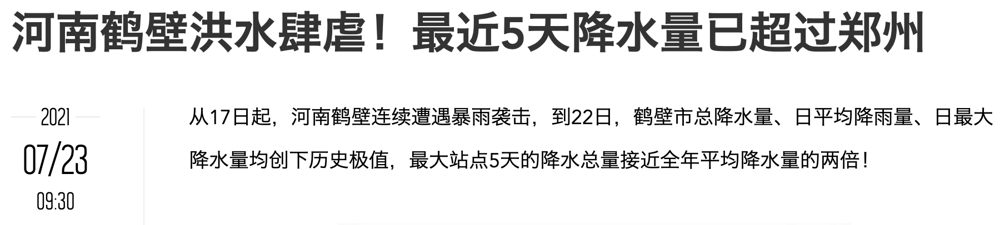 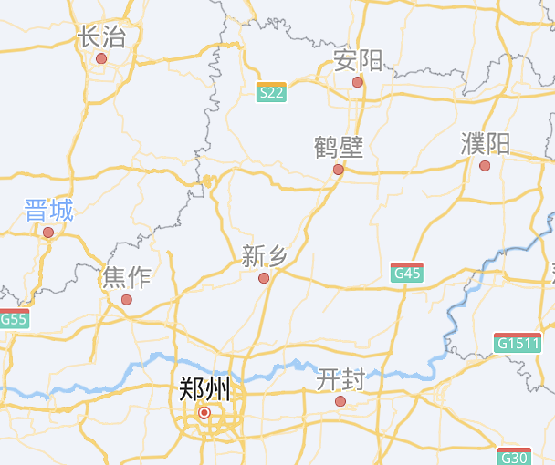

---

<!-- _class: lead -->

## <!-- fit --> 谢谢聆听
