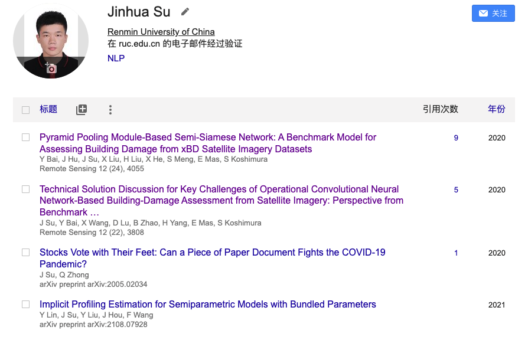
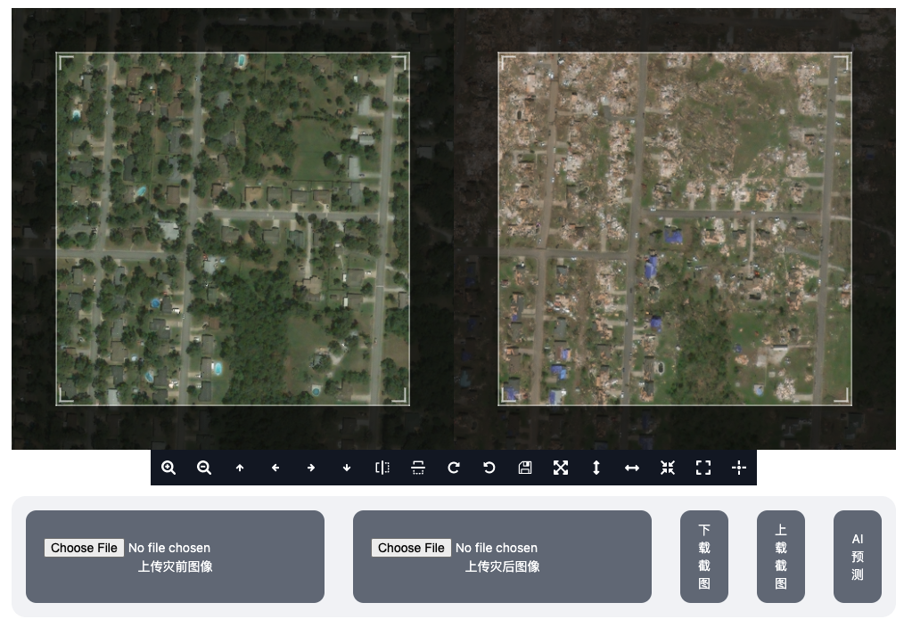

### 司马数慧AI自动定损（simashuhui.cn）

  
  

---

### 我们的工作成果

- 前身（学研）：智慧数据科研辅助服务 
- Remote Sensing论文两篇、专利一项
- 无人机影像数据：8月1-3日河南洪水
- 主办R会议灾害风险会场汇报迁移学习
- 官网及模型开放API（自建+穿透+云）
- 巨灾指数保险文章Risk Analysis在投
- 减灾应急部&PICC山洪AI识别课题申请

收入补贴：网站开发(yunyaculture.cn)
大规模并行爬虫、小程序开发